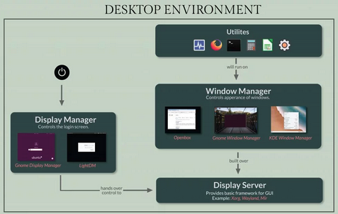

## Creating a Scanning Solution using Raspberry Pi, EVDEV, and Kiosk Mode

> _Updated: Sunday. July 5th, 2022_

This is a guided process to setup the Raspberry Pi to be an all-in-one **Scanning Solution**. While this project is built upon a Raspberry Pi, the EVDEV library that is used to capture events is based on Linux Canonical. Meaning this project will work on linux environments.

# Table of Contents

- <a href="#install">Install and Setup</a>
  - <a href="#createUser">Create User</a>
  - <a href="#wifi">Configure Wi-Fi</a>
  - <a href="#python3">Python3, pip, venv, evdev, python-socketio</a>
  - <a href="#scp">Copying Files from Remote to Pi via SCP</a>
  - <a href="#gui">The GUI</a>
  - <a href="#snaps">Installing Chromium using (Snaps)</a>
  - <a href="#autoLogin">Enable Auto Login without Password</a>
  - <a href="#disableFeatures">Disable Sleep, Suspend, and Hibernate</a>
  - <a href="#loadAppOnStart">Auto-Start an Application on Login</a>
  - <a href="#evdev">Python and EVDEV (Scanner App)</a>
  - <a href="#socketio">Python and Socket.io</a>
  - <a href="#daemon">Daemon Services - Backend Management</a>
  - <a href="#hideMouse">Hide Mouse Cursor</a>

<h1 id="install">Install and Setup</h1>

_This project is currently using **Ubuntu Server 20.04** for ARM provided by **Raspberry Pi Imager**._


#### - Install the Ubuntu Server on the Raspberry Pi 4B (64-bit edition)

<br />

<hr />
<h3 id="createUser">Create User - scan1</h3>
<hr />


1. Log into the default user:

```yaml
user: ubuntu
pass: ubuntu
```

2. When prompted change the default password. (For production this should be 32+ characters or longer)

```yaml
pass: Password1
```

3. Once you are logged in. Create the user `scan1` running the following **Ubuntu Command**<br />
   <span style="border: solid 2px #999; border-radius: 5px; padding: 4px; display: inline-block; margin: 10px 0; background-color: #DCDADA;"><em>Do not use spacing between commas for groups!</em></span>
   **Example:** $ `sudo` `useradd` -s /bin/bash -d /home/`<user>` -m -G sudo,input,... `<user>`

```bash

$ sudo useradd -s /bin/bash -d /home/scan1/ -m -G sudo,input,adm,dialout,dip,plugdev,netdev,lxd scan1
```

4. Set the new user `scan1` password to `scan11`. You will be prompted once you type in the following...<br />

```bash
$ sudo passwd scan1
$ scan11
```

    _(For production this should be 32+ characters or longer)_

<br />

<hr />
<h3 id="wifi">Configure Wi-Fi</h3>
<hr />


- If you are not using the Raspberry Pi, then you may want to run the command to find out what your `wlan` (wireless) adapter is called.

```bash
$ ls /sys/class/net
```

1. Run

```bash
$ ls /etc/netplan/
```

2. You should see a file by the name of: **50-cloud-init.yaml**

3. Edit this file by typing:

```bash
$ sudo nano /etc/netplan/50-cloud-init.yaml
```

4. The contents of the file will contain the following...

```yaml
# This file is generated from information provided by the datasource.  Changes
# to it will not persist across an instance reboot.  To disable cloud-init's
# network configuration capabilities, write a file
# /etc/cloud/cloud.cfg.d/99-disable-network-config.cfg with the following:
# network: {config: disabled}
network:
  ethernets:
    eth0:
      dhcp4: true
      optional: true
  version: 2
```

5. Under the `version: 2` line add `wifis` along with SSID and Password. - By default: **wlan0** is Wi-Fi adapter for the Raspberry Pi. Make sure the double quotes in front of the SSID is the 4 spaces from the access-points, same with the `p` in password. It must be 4 spaces!

   _**Note:** Each indent is 4 spaces using the `spacebar` - **DO NOT USE TABS!**_

```yaml
# This file is generated from information provided by the datasource.  Changes
# to it will not persist across an instance reboot.  To disable cloud-init's
# network configuration capabilities, write a file
# /etc/cloud/cloud.cfg.d/99-disable-network-config.cfg with the following:
# network: {config: disabled}
network:
  ethernets:
    eth0:
      dhcp4: true
      optional: true
  version: 2
  wifis:
    wlan0:
      optional: true
      access-points:
        "SSID-NAME-HERE":
          password: "PASSWORD-HERE"
      dhcp4: true
```

_I don't belive it need to be stated. But to save and close the file press: **Ctrl + x** followed by the **y** key._

6. Debug and Apply the settings by typing:

```bash
$ sudo netplan --debug apply
```

_If you don't see any messages then you correctly formatted the document. If you do it means you likely messed up the spacing or mistyped something_

7. Finally, reboot the system to make sure the changes take effect by running.

```bash
$ sudo reboot
```

8. Confirm that you are connected to the network by typing:

```bash
$ ip a
```

_You should see an ip address assigned to **wlan0**_

<hr />
<h3 id="python3">Python3, pip, venv, evdev, python-socketio</h3>
<hr />


1. Install the follow in order:

```bash
$ sudo apt install python3-venv
$ sudo apt install python3-pip
```

2. Though it may not be required, it is recommended that you install `rust`

```bash
$ curl https://sh.rustup.rs -sSf | sh
$ sudo reboot
```

3. Create the directory `app` then create a virtual environment `venv` called `scanner`

```bash
$ mkdir apps
$ cd apps
$ python3 -m venv ./scanner
```

4. Activate the virtual environment

```bash
$ cd scanner
$ source bin/activate
```

    Expected output: `$(scanner) `

5. Update the virtual environments: pip, wheel, and setuptools

```bash
$(scanner) python3 -m pip install --upgrade pip
$(scanner) python3 -m pip install -U pip wheel setuptools
```

6. Install `evdev` - https://python-evdev.readthedocs.io/en/latest/

```bash
$(scanner) pip install evdev
```

7. Install `socket io` - https://python-socketio.readthedocs.io/en/latest/

```bash
$(scanner) pip install python-socketio
```

<hr />
<h3 id="scp">Copying Files from Remote to Pi via SCP</h3>
<hr />


1. On the Pi, create the directory `app` inside of the `apps/scanner/` directory

2. On your remote machine create the file: **scanner.py** and add the following code to it:

```python
print("It works!")
```

3. Now using SCP upload the file to your pi in the `/home/scan1/apps/scanner/app/` directory.

```bash
# scp <local-file-path> scan1@192.168.0.3:/home/scan1/apps/scanner/app/
$ scp ./scanner.py scan1@192.168.0.3:/home/scan1/apps/scanner/app
```

4. Check your pi's directoy and make sure the file was uploaded.

5. Let's run the test script.

6. In your SSH terminal run the `scanner.py` script

```bash
$(scanner) python scanner.py
```

7. You should see the output: `It works!`

<hr />
<h3 id="gui">The GUI</h3>
<hr />


At this point you are welcome to ssh into Raspberry Pi using a terimal on a separate computer but it isn't required.

1. Now that you are connected to the network it's time to run some basic updates.

2. Run the following in order:

```bash
$ sudo apt update
$ sudo apt upgrade
```

3. It's time to install a base level GUI without any bells and whistles.

   For details on the following setup please view <br />
   https://www.linuxfordevices.com/tutorials/ubuntu/install-gui-on-ubuntu-server


<br /><br />

4. 1st) we will install the **Display Server** - This will take a bit of time to install, so please be patient. Type:

```bash
$ sudo apt install xorg
```

5. 2nd) we install the **Window Manager** by typing:

```bash
$ sudo apt install openbox
```

6. 3rd) we install the **Display Manager** by typing:

```bash
$ sudo apt install lightdm
$ sudo apt install lightdm-gtk-greeter
```

7. Reboot the system and log back in. You should see a login screen now.

```bash
$ sudo reboot
```

<hr />
<h3 id="snaps">Installing Chromium using (Snaps)</h3>
<hr />


To install the browser and any other desktop application we will use the Ubuntu Snaps integration. Learn more about snaps... https://ubuntu.com/tutorials/create-your-first-snap#1-overview

1. Use the find command to search for an available program provided by snaps.

```bash
# snap find <applicaiton-name>
$ snap find chromium
```

2. Install Chromium (browser)

```bash
$ sudo snap install chromium
```

3. Confirm chromium is installed by typing;

```
$ snap list
```

4. If you want to run any application from the terminal you just have to type the applications name. For example to run the **chromium browser** you would type:

```bash
$ chromium-browser
```

<hr />
<h3 id="autoLogin">Enable Auto Login without Password</h3>
<hr />


> This assumes you've installed `lightdm`

1. Create the file: `/etc/lightdm/lightdm.conf`

```bash
$ sudo nano /etc/lightdm/lightdm.conf
```

2. Add the following lines to the `lightdm.conf` (case-sensitive) - scan1 is the user created at the beginning of this instructional document. Then save and close the document.

```bash
[Seat:*]
autologin-user=scan1
```

3. Add the user `scan1` to the auto-login group

```
$ sudo usermod -a -G nopasswdlogin scan1
```

4. Reboot and cofirm user `scan1` automatically logs in.

```bash
$ sudo reboot
```

<br />

<hr />
<h3 id="disableFeatures">Disable Sleep, Suspend, and Hibernate</h3>
<hr />


We've configured most of the standard setup but we need to make sure the system doesn't every go to sleep or suspend.
Take from: https://linux-tips.us/how-to-disable-sleep-and-hibernation-on-ubuntu-server/

1. Either on the desktop or through ssh. Open a terminal type the following:

```bash
$ sudo systemctl mask sleep.target
$ sudo systemctl mask suspend.target
$ sudo systemctl mask hibernate.target
$ sudo systemctl mask hybrid-sleep.target
#
# -- confirm status --
#
$ systemctl status sleep.target
```

<br />

<hr />
<h3 id="loadAppOnStart">Auto-Start an Application on Login</h3>
<hr />


1. In the terminal: `cd` into the `.config` directory and create a new directory called `autostart`

```bash
$ cd ~/.config
$ mkdir autostart
```

2. `cd` into the `autostart` directory and create the file: **chromium.desktop**

```bash
$ cd autostart
$ nano chromium.desktop
```

3. Edit the `chromium.desktop` file and add the following content:

```bash
[Desktop Entry]
Name=Chromium Browser
Exec=chromium --kiosk https://angular.io
Type=Application
Comment=Starts Chromium Browser in Kiosk Mode, disabling F11. Can only close using (Ctrl + F4)
X-GNOME-Autostart-enabled=true
```

`showip.desktop`
This application currently loads before the browser kiosk mode. If you are having issues connecting to pi, then connect keyboard to the device and click the `windows key` to show available windows. The `terminal` should be open. `alt + tab` to switch between windows. Remove the exec value for production or `rm` the file.

```bash
[Desktop Entry]
Name=Show IP(s)
Exec=bash -c 'ip a; $SHELL'
Terminal=true
Type=Application
Comment=Show system IP Addresses. Good for (only) testing. IP sometimes changes when connected to DHCP Wi-Fi
X-GNOME-Autostart-enabled=true
```

<hr />
<h3 id="evdev">Python and EVDEV (Scanner App)</h3>
<hr />


Using the **evedev** library we are able to figure out the connected devices info and event path

#### Get Device Info

To List all devices and their info run:

```python
import evdev

devices = [evdev.InputDevice(path) for path in evdev.list_devices()]

for device in devices:
    print(device.info) # info returns a DeviceInfo() object
```

#### Get Device Event Path

To display the paths for each device run:

```python
import evdev

devices = [evdev.InputDevice(path) for path in evdev.list_devices()]

for device in devices:
    print(device.path) # grabs the devices path: ...ex: /dev/input/event1
    # if you print the entire device you get something like this:
    # device /dev/input/event1, name "TMS HIDKeyBoard", phys "usb-0000:01:00.0-1.3/input0"
```

#### Handling Errors

If the device is disconncted while running it will throw the error

```yaml
OSError: [Error 19] No such device
```

7. Using the barcode scanner, scan a barcode. You should see something like the output below. It will different for each barcode.

```bash
$(scanner) python scanner.py
device /dev/input/event1, name "TMS HIDKeyBoard", phys "usb-0000:01:00.0-1.3/input0"
key event at 1650400435.865572, 11 (KEY_0), down
key event at 1650400435.867508, 11 (KEY_0), up
key event at 1650400435.869544, 4 (KEY_3), down
key event at 1650400435.871503, 4 (KEY_3), up
key event at 1650400435.873506, 6 (KEY_5), down
key event at 1650400435.875499, 6 (KEY_5), up
key event at 1650400435.877496, 8 (KEY_7), down
key event at 1650400435.879493, 8 (KEY_7), up
key event at 1650400435.881495, 6 (KEY_5), down
key event at 1650400435.883492, 6 (KEY_5), up
key event at 1650400435.885497, 2 (KEY_1), down
key event at 1650400435.887493, 2 (KEY_1), up
key event at 1650400435.889503, 2 (KEY_1), down
key event at 1650400435.891498, 2 (KEY_1), up
key event at 1650400435.893503, 2 (KEY_1), down
key event at 1650400435.895496, 2 (KEY_1), up
key event at 1650400435.897511, 2 (KEY_1), down
key event at 1650400435.899500, 2 (KEY_1), up
key event at 1650400435.901505, 11 (KEY_0), down
key event at 1650400435.903502, 11 (KEY_0), up
key event at 1650400435.905504, 7 (KEY_6), down
key event at 1650400435.907501, 7 (KEY_6), up
key event at 1650400435.909503, 5 (KEY_4), down
key event at 1650400435.911501, 5 (KEY_4), up
key event at 1650400435.913501, 28 (KEY_ENTER), down
key event at 1650400435.915507, 28 (KEY_ENTER), up
```

#### Capture Events and Display Code as String

The following code takes the events captured above and merges all down events into a single string displaying the KEY\_ value aka. barcode. When the `enter` key is received the value is cleared for the next scan. The hardware is simple and should only handle basic logic to accurately display the scan and nothing else. All other logic should and will be handled in the websocket service in NestJS on the Docker container. - This application should run as a `daemon service`.

```python
# scanner.py

import evdev
import json
import time

def find_device(scanner: dict) -> str:
    """Find and return connect scanner device 'event' path. ...ex: /dev/input/event1

    Keyword arguments:
    scanner -- (dict) References file 'device.json'
    Return: (str) Active Device Path
    """

    active_event_path = "" # will be set after device is found
    devices = [evdev.InputDevice(path) for path in evdev.list_devices()]

    # find and set scanner event_id/path
    for device in devices:
        # get str of original hex value NOT decimal
        vendor_id = hex(device.info.vendor)
        product_id = hex(device.info.product)
        if vendor_id == scanner_device["vendor"] and product_id == scanner_device["product"]:
            active_event_path = device.path

    return active_event_path


def capture_events(event_path: str):
    """Capture events from connected device (scanner device)

    Keyword arguments:
    event_path -- (str) The event path of the connected device. ...ex: /dev/input/event1
    """

    # assign device by event path
    device = evdev.InputDevice(event_path)
    print(device) # hide for production

    # store captured event from mouse-down or 1 (on key press)
    scan_events = ""

    # print out events from all devices
    for event in device.read_loop():
        if event.type == evdev.ecodes.EV_KEY:
            key_event = evdev.events.KeyEvent(event)
            if key_event.keystate == 1: # down state or button pressed
                key_code = key_event.keycode.replace("KEY_", "").lower()
                if key_code != "enter": # append scan
                    scan_events += key_code
                else:
                    print(scan_events) # replace with client socket
                    scan_events = "" # reset string when enter key is found

# ====================================================
# ------- Execute App ----------
# ====================================================
#
if __name__ == "__main__":
    # assign device by json_file - device.json
    with open('./device.json', 'r') as json_file:
        scanner_device = json.load(json_file)

    while True:
        active_event_path = find_device(scanner_device)

        if active_event_path != "":
            try:
                capture_events(active_event_path)
            except OSError as err:
                print(err)
                print(f"Can't find path: {active_event_path}. Check if device has disconnected.")
                continue

```

<hr />
<h3 id="socketio">Python and Socket.io</h3>
<hr />


Since we are using python to listen to the physicall scanner events. We will also use python version of Socket.io along with it. Once a barcode and zone have been scanned and meet the scanning requirements we will sent a client `emit()` message to the Docker Container NestJS Socket Server.

<hr />
<h3 id="daemon">Daemon Services - Backend Management</h3>
<hr />


All scripts must run as background process aka. daemon services

- https://medium.com/@benmorel/creating-a-linux-service-with-systemd-611b5c8b91d6
- https://www.journaldev.com/39332/ubuntu-start-stop-restart-services

1. Python Script (Sample)

2. When running a virtual environment in a terminal you normally run the command `source ./bin/activate`. `source` only works for the currently open and active terminal/shell/bash window.

3. When running this as a service **NOT** in an active terminal in background you need to define the **absolute paths** to the **venv**.

```yaml
#(Example)
user: scan1
venv: scanner
```

4. log.py (sample python file)

```python
import time
import os
import evdev # custom library in scanner venv

if __name__ == "__main__":
    # 'apps' is a custom directory created for development
    # this could be called anything...
    # same with 'app' inside the 'scanner' venv
    _dir = os.path.join("/", "home", "scan1", "apps", "app")

    with open(os.path.join(_dir, "info.log"), 'a+') as _file:
        for i in range(10):
            tm = time.localtime()
            f_tm = time.strftime("%H:%M:%S", tm)
            time.sleep(2)
```

5. Next, we create a Daemon Service file. Services are stored in... /etc/systemd/system/ and named as follows:

```bash
# <service-name>.service
log-timer.service
```

6. When creating a service use sudo:

```bash
sudo nano /etc/systemd/system/log-timer.service
```

7. Here is a basic setup for the service:

```bash
[Unit]
Description=ROT13 demo service
After=network.target
StartLimitIntervalSec=0

[Service]
Type=simple
Restart=always
RestartSec=1
User=scan1
ExecStart=/home/scan1/apps/scanner/bin/python3 /home/scan1/apps/scanner/app/log.py

[Install]
WantedBy=multi-user.target
```

> You will need to change the User and ExecStart

The **ExecStart** for a custom virtual environment, requires that you point to the `absolute path` of the `venv`. Then follow it with a space and the `absolute path` to the `python script`.

8. Let's reload all Daemons, enable our current Daemon, and Start it.

```bash
sudo systemctl daemon-reload
sudo systemctl enable log-timer
sudo systemctl start log-timer
```

9. Check Daemon Service status

```bash
sudo systemctl status log-timer
```

<hr />
<h3 id="hideMouse">Hide Mouse Cursor</h3>
<hr />


1. This should be your last step once the system is ready for deployment. Type:

```bash
$ sudo nano /etc/lightdm/lightdm.conf
```

2. Add the following line at the bottom, save, and reboot.

```bash
$ xserver-command=X -nocursor
```
